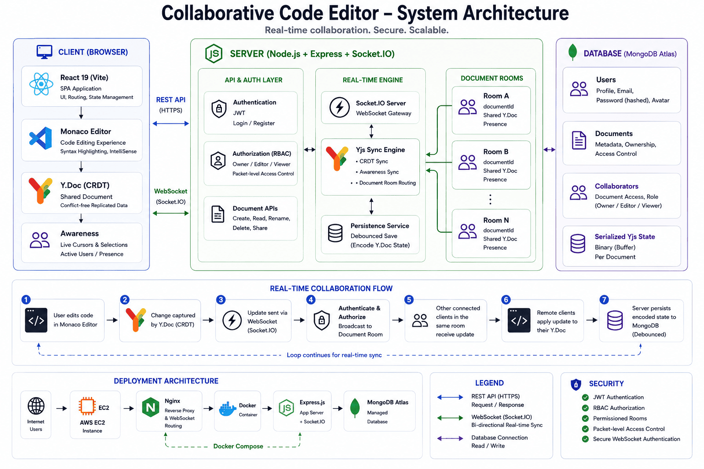
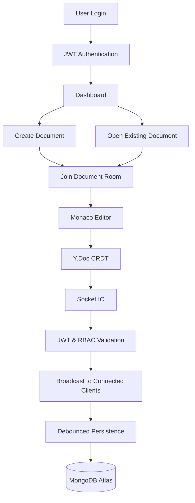

# 🚀 Collaborative Code Editor

<p align="center">
  <strong>A full-stack collaborative code editor demonstrating conflict-free real-time synchronization, secure document sharing, and production-ready cloud deployment.</strong>
</p>

<p align="center">
  Built with <strong>React</strong>, <strong>Node.js</strong>, <strong>Express</strong>, <strong>Socket.IO</strong>, <strong>Yjs</strong>, <strong>Monaco Editor</strong>, <strong>MongoDB Atlas</strong>, <strong>Docker</strong>, and <strong>AWS EC2</strong>.
</p>

<p align="center">
  
  
  
  
  
  
  
</p>

<p align="center">

<a href="#-system-architecture">Architecture</a> •
<a href="#-technology-stack">Tech Stack</a> •
<a href="#-getting-started">Getting Started</a> •
<a href="#-api-overview">API</a>

</p>

---

## 📑 Table of Contents

- [System Architecture](#-system-architecture)
- [Project Overview](#-project-overview)
- [Key Features](#-key-features)
- [Technology Stack](#-technology-stack)
- [Deployment](#-deployment)
- [Project Workflow](#-project-workflow)
- [Repository Structure](#-repository-structure)
- [Getting Started](#️-getting-started)
- [Production Deployment](#️-production-deployment)
- [API Overview](#-api-overview)
- [Security Features](#-security-features)
- [Why This Project Stands Out](#-why-this-project-stands-out)
- [Future Improvements](#-future-improvements)
- [License](#-license)

---


# 🏗️ System Architecture

<p align="center">
  
</p>

> The diagram illustrates the complete system architecture, including the React client, REST APIs, Socket.IO communication, document-based collaboration rooms, MongoDB persistence, and production deployment on AWS EC2.

---

# 📖 Project Overview

Collaborative Code Editor is a production-grade full-stack web application that enables multiple users to edit the same source code document simultaneously without merge conflicts.

Unlike traditional collaborative editors that rely on Operational Transforms (OT), this application uses **Conflict-free Replicated Data Types (CRDTs)** through **Yjs**, enabling deterministic conflict resolution and eventual consistency across all connected clients.

The application combines a **React + Monaco Editor** frontend with a **Node.js/Express** backend, **Socket.IO** for real-time communication, and **MongoDB Atlas** for persistent document storage. Users can securely authenticate using JWT, create collaborative workspaces, share documents using role-based permissions, and collaborate in isolated document rooms with real-time synchronization.

The project is fully containerized using Docker, reverse-proxied through Nginx, and has been successfully deployed on AWS EC2 using MongoDB Atlas as the cloud database.

---
## 📊 Project Statistics

| Metric              |                              Value |
| ------------------- | ---------------------------------: |
| Architecture        |           Full-Stack Client–Server |
| Frontend            |                    React 19 + Vite |
| Backend             |                  Node.js + Express |
| Database            |                      MongoDB Atlas |
| Real-Time Engine    |             Socket.IO + Yjs (CRDT) |
| Authentication      |                       JWT + bcrypt |
| Authorization       |   Role-Based Access Control (RBAC) |
| Deployment          |           Docker + Nginx + AWS EC2 |
| Collaboration Model | Document-Based Collaboration Rooms |
| Communication       |             REST APIs + WebSockets |

---

# ✨ Key Features

## 🔄 Real-Time Collaboration

- Conflict-free collaborative editing powered by **Yjs CRDTs**
- Instant synchronization through **Socket.IO**
- Independent collaboration rooms for every document
- Live presence and awareness of connected collaborators
- Automatic document recovery after reconnection

---

## 🔐 Authentication & Authorization

- Secure JWT-based authentication
- Password hashing using bcrypt
- Role-Based Access Control (Owner, Editor, Viewer)
- Permission enforcement across REST APIs and WebSockets
- Packet-level authorization for collaborative updates

---

## 📄 Document Management

- Create collaborative documents
- Rename documents
- Delete documents
- Share documents with registered users
- Update collaborator permissions
- Unified dashboard for owned and shared documents

---

## ⚡ Real-Time Synchronization

- CRDT synchronization using Yjs
- WebSocket communication via Socket.IO
- Debounced document persistence
- Binary state serialization
- Automatic synchronization of concurrent edits

---

## 🗄️ Persistent Storage

MongoDB stores:

- User accounts
- Document metadata
- Collaborator permissions
- Serialized Yjs document state

---

## ☁️ Production Deployment

- Multi-stage Docker builds
- Docker Compose orchestration
- Nginx reverse proxy
- MongoDB Atlas
- AWS EC2 deployment

---

# 🛠️ Technology Stack

| Category | Technologies |
|-----------|--------------|
| **Frontend** | React 19, Vite, Monaco Editor, React Router DOM, Tailwind CSS, Lucide React |
| **Backend** | Node.js, Express.js, Socket.IO |
| **Real-Time Collaboration** | Yjs (CRDT), y-monaco, y-socket.io |
| **Database** | MongoDB Atlas, Mongoose |
| **Authentication & Security** | JWT, bcrypt, Role-Based Access Control (RBAC) |
| **State Management** | React Context API |
| **DevOps & Deployment** | Docker, Docker Compose, Nginx, AWS EC2 |
| **Developer Tooling** | Axios, React Hot Toast, ESLint |

---

# 🔄 Project Workflow



### Workflow Summary

1. Users authenticate using JWT-based authentication.
2. After successful login, users can create new documents or access documents shared with them.
3. Opening a document establishes a WebSocket connection and joins the corresponding collaboration room.
4. Every code change is converted into a **Yjs CRDT update**, ensuring conflict-free synchronization across all connected collaborators.
5. The backend validates permissions before broadcasting updates to the document room.
6. The collaborative document state is periodically serialized and persisted to **MongoDB Atlas** using a debounced persistence strategy.

---

# 📂 Repository Structure

```text
Collaborative-Code-Editor/
│
├── Backend/
│   ├── middleware/          # JWT authentication & RBAC
│   ├── models/              # MongoDB schemas
│   ├── routes/              # Authentication & Document APIs
│   ├── server.js            # Express + Socket.IO server
│   ├── db_check.js          # Database inspection utility
│   ├── test.js              # Integration test suite
│   └── package.json
│
├── Frontend/
│   ├── public/
│   ├── src/
│   │   ├── context/
│   │   ├── lib/
│   │   ├── pages/
│   │   ├── index.css
│   │   └── main.jsx
│   ├── package.json
│   └── vite.config.js
│
├── docs/
│   └── images/
│       └── system-architecture.png
│
├── Dockerfile
├── docker-compose.yml
├── nginx.conf
├── setup.sh
└── README.md
```

---

# ⚙️ Getting Started

## Prerequisites

Install the following before running the project:

- Node.js 20+
- npm
- MongoDB (Local) or MongoDB Atlas
- Git
- Docker & Docker Compose *(optional for containerized deployment)*

Verify your installation:

```bash
node --version
npm --version
```

---

## Clone the Repository

```bash
git clone https://github.com/indrajithas673/Collaborative-Code-Editor.git

cd Collaborative-Code-Editor
```

---

## Backend Setup

Install backend dependencies.

```bash
cd Backend

npm install
```

Create a `.env` file.

```env
MONGODB_URI=your_mongodb_connection_string

JWT_SECRET=your_secure_secret

PORT=3000
```

Start the backend server.

```bash
npm run dev
```

---

## Frontend Setup

Open another terminal.

```bash
cd Frontend

npm install

npm run dev
```

The Vite development server will automatically start.

---

## Running with Docker

Build and start the complete application.

```bash
docker compose up --build
```

---

# ☁️ Production Deployment

The project supports production deployment using Docker, Nginx, and AWS EC2.

### Deployment Components

- AWS EC2
- Docker
- Docker Compose
- Nginx Reverse Proxy
- MongoDB Atlas

### Deployment Workflow

1. Launch an AWS EC2 instance.
2. Install Docker and Docker Compose or execute the provided `setup.sh` script.
3. Configure the required environment variables.
4. Build and start the application using Docker Compose.
5. Nginx proxies both HTTP requests and WebSocket traffic to the application container.
6. Express serves the production React build together with the REST APIs and Socket.IO server.

> The repository includes `Dockerfile`, `docker-compose.yml`, `nginx.conf`, and `setup.sh` to reproduce the deployment environment.

---

# 🔌 API Overview

The backend exposes REST APIs for authentication, document management, and collaboration.

## Authentication

| Method | Endpoint | Description |
|:------:|----------|-------------|
| POST | `/api/auth/register` | Register a new user |
| POST | `/api/auth/login` | Authenticate a user and return a JWT |

---

## Documents

| Method | Endpoint | Description |
|:------:|----------|-------------|
| GET | `/api/documents` | Retrieve all owned and shared documents |
| POST | `/api/documents` | Create a collaborative document |
| GET | `/api/documents/:id` | Retrieve document metadata |
| PUT | `/api/documents/:id` | Rename a document |
| DELETE | `/api/documents/:id` | Delete a document (Owner only) |

---

## Collaboration

| Method | Endpoint | Description |
|:------:|----------|-------------|
| POST | `/api/documents/:id/share` | Share a document with another user |
| DELETE | `/api/documents/:id/share/:userId` | Remove a collaborator |

> **Note:** Real-time synchronization is performed through **Socket.IO** and **Yjs**, while REST APIs handle authentication, document metadata, and access management.

---

# 🔒 Security Features

Security is a core aspect of the application design, ensuring that authentication, authorization, and real-time collaboration remain protected throughout the system.

## Authentication

- JWT-based user authentication
- Password hashing using **bcrypt**
- Protected REST API endpoints
- Secure WebSocket authentication during connection establishment

---

## Authorization

- Resource-level **Role-Based Access Control (RBAC)**
- Three permission levels:
  - **Owner**
  - **Editor**
  - **Viewer**
- Ownership validation for sensitive document operations
- Authorization enforced across both REST APIs and WebSocket communication

---

## Real-Time Collaboration Security

- JWT validation before establishing WebSocket connections
- Document-level permission verification before joining collaboration rooms
- Packet-level authorization preventing unauthorized collaborative updates
- Viewer users are restricted to read-only collaboration sessions

---

## Data Protection

- Passwords are never stored in plain text
- Serialized collaborative document state is securely persisted in MongoDB
- Authorization checks performed before every protected operation

---

# ⭐ Why This Project Stands Out

Unlike a traditional CRUD-based full-stack application, this project demonstrates several advanced software engineering concepts.

### Real-Time Distributed Collaboration

Implements **Conflict-free Replicated Data Types (CRDTs)** using **Yjs**, enabling multiple users to edit the same document simultaneously without merge conflicts.

---

### Isolated Collaboration Rooms

Each document operates as an independent collaboration room with its own:

- Shared Y.Doc instance
- Connected collaborators
- Awareness state
- Persistent storage lifecycle

allowing multiple editing sessions to run concurrently.

---

### Secure Real-Time Communication

Authorization extends beyond REST APIs.

Every WebSocket connection is authenticated and every collaborative update is validated before being propagated to connected clients.

---

### Production-Oriented Architecture

The project follows a modular architecture separating:

- Frontend
- Backend
- Authentication
- Authorization
- Real-time synchronization
- Persistence
- Deployment

making the codebase easier to understand and maintain.

---

### Cloud Deployment

The application has been successfully deployed using:

- AWS EC2
- Docker
- Docker Compose
- Nginx Reverse Proxy
- MongoDB Atlas

demonstrating production deployment knowledge beyond local development.

---

# 📈 Future Improvements

Although the project is fully functional, several enhancements can further extend its capabilities.

- Implement document version history using the existing schema.
- Add OAuth authentication (Google/GitHub).
- Introduce collaborative comments and annotations.
- Display live collaborator cursors and text selections.
- Support multiple programming language execution.
- Add Kubernetes deployment for horizontal scalability.
- Implement rate limiting and API monitoring.
- Introduce CI/CD pipelines using GitHub Actions.

---

# 🤝 Contributing

Contributions are welcome.

If you'd like to improve the project:

1. Fork the repository.
2. Create a feature branch.

```bash
git checkout -b feature/your-feature
```

3. Commit your changes.

```bash
git commit -m "feat: add your feature"
```

4. Push the branch.

```bash
git push origin feature/your-feature
```

5. Open a Pull Request.

Please ensure that code changes are well documented and follow the existing project structure.

---

## 📄 License

This project is licensed under the **MIT License**.

See the [LICENSE](LICENSE) file for more information.